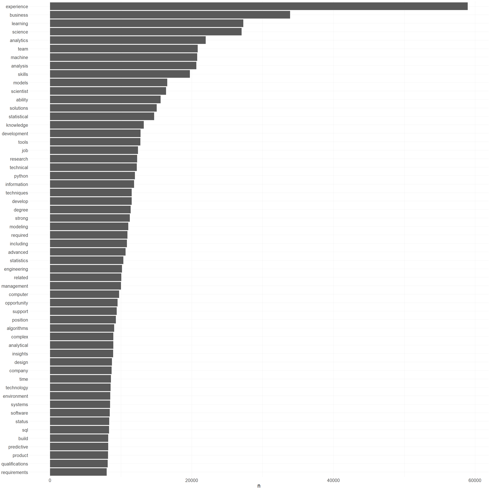

Text Mining with R (Job Postings of Data Science)
================
Kristijan Bakaric
3/17/2020


I will guide you through few basic examples from an amazing book [Text
Mining with R](https://www.tidytextmining.com/index.html) where we
explore:

  - what we mean by tidy data when it comes to text
  - how tidy data principles can be applied to natural language
    processing

When text is organized in a format with one token per row, tasks like
removing stop words or calculating word frequencies are natural
applications of familiar operations within the tidy tool ecosystem.

The one-token-per-row framework can be extended from single words to
n-grams and other meaningful units of text, as well as to many other
analysis priorities that we will consider in this book.

## Main questions we would like to answer

**What are the most common words occuring in the job descriptions?**

**What are the most common cooccuring word pairs in the job
descriptions?**

## Data

Data that we will work with contains 10000 Data Science Job Descriptions
and it is available for download on
[data.world](https://data.world/jobspikr/10000-data-scientist-job-postings-from-the-usa).
Data was extracted using [JobsPikr](https://www.jobspikr.com/) - a job
data delivery platform that extracts job data from job boards across the
globe.

## Let’s begin by loading the libraries and the data

We will use several packages from:

  - `tidyverse` - The ‘tidyverse’ is a set of packages that work in
    harmony because they share common data representations and ‘API’
    design.

  - `tidytext` - This package implements tidy data principles to make
    many text mining tasks easier, more effective, and consistent with
    tools already in wide use.

<!-- end list -->

``` r
#install.packages("tidyverse")
#install.packages("tidytext")
#install.packages("igraph")
#install.packages("ggraph")
#install.packages(("widyr")
```

``` r
library(tidyverse)
library(tidytext)
```

``` r
job_postings <- read_csv("data/data_scientist_united_states_job_postings_jobspikr.csv")
```

``` r
#problems(job_postings)
```

## Select only relevant columns and show few rows from the loaded table:

``` r
job_postings <- job_postings %>% 
  select(uniq_id, job_description)

head(job_postings)
```

    ## # A tibble: 6 x 2
    ##   uniq_id                 job_description                                       
    ##   <chr>                   <chr>                                                 
    ## 1 3b6c6acfcba6135a31c83b~ "Read what people are saying about working here. \n\n~
    ## 2 741727428839ae7ada852e~ "We have an immediate opening for a Sharp Data Scient~
    ## 3 cdc9ef9a1de327ccdc19cc~ "Candidates should have the following background, ski~
    ## 4 1c8541cd2c2c924f9391c7~ "Read what people are saying about working here. \n\n~
    ## 5 445652a560a54410608578~ "We are seeking an extraordinary Data Scientist in Ch~
    ## 6 9571ec617ba209fd9a4f84~ "Read what people are saying about working here. \n\n~

## Few example rows of only from the `job_description` column.

``` r
job_postings %>% select(job_description) %>% slice(1:10)
```

    ## # A tibble: 10 x 1
    ##    job_description                                                              
    ##    <chr>                                                                        
    ##  1 "Read what people are saying about working here. \n\nWe are Farmers!\n\nJoin~
    ##  2 "We have an immediate opening for a Sharp Data Scientist with a strong Mathe~
    ##  3 "Candidates should have the following background, skills and characteristics~
    ##  4 "Read what people are saying about working here. \n\nAbout BlackRock\n\nBlac~
    ##  5 "We are seeking an extraordinary Data Scientist in Charlotte to join our fas~
    ##  6 "Read what people are saying about working here. \n\nOpportunity\n\nThe oppo~
    ##  7 "Read what people are saying about working here. \n\nAt Spotify our mission ~
    ##  8 "Job Title: - Sr. Data Science Consultant Duration: 1+ Yrs (will get extend)~
    ##  9 "Read what people are saying about working here. \n\nAbout BlackRock\n\nBlac~
    ## 10 "• 3+ years related a professional experience  • Proven achievements resulti~

## Splitting job\_description column into one-token-per-row.

First we split a column `job_description` into tokens using the
tokenizers package, splitting the table into one-token-per-row.

``` r
job_description_tokenized <- job_postings %>% 
    unnest_tokens(output = "job_description_words", input = job_description)
```

**Table has 5721450 rows and 2 columns.**

``` r
kableExtra::kable(head(job_description_tokenized))
```

<table>

<thead>

<tr>

<th style="text-align:left;">

uniq\_id

</th>

<th style="text-align:left;">

job\_description\_words

</th>

</tr>

</thead>

<tbody>

<tr>

<td style="text-align:left;">

3b6c6acfcba6135a31c83bd7ea493b18

</td>

<td style="text-align:left;">

read

</td>

</tr>

<tr>

<td style="text-align:left;">

3b6c6acfcba6135a31c83bd7ea493b18

</td>

<td style="text-align:left;">

what

</td>

</tr>

<tr>

<td style="text-align:left;">

3b6c6acfcba6135a31c83bd7ea493b18

</td>

<td style="text-align:left;">

people

</td>

</tr>

<tr>

<td style="text-align:left;">

3b6c6acfcba6135a31c83bd7ea493b18

</td>

<td style="text-align:left;">

are

</td>

</tr>

<tr>

<td style="text-align:left;">

3b6c6acfcba6135a31c83bd7ea493b18

</td>

<td style="text-align:left;">

saying

</td>

</tr>

<tr>

<td style="text-align:left;">

3b6c6acfcba6135a31c83bd7ea493b18

</td>

<td style="text-align:left;">

about

</td>

</tr>

</tbody>

</table>

## Getting rid of the english stop words

`stop_words` data frame comes via `{tidytext}` package and is loaded
below. A data frame is with 1149 rows and 2 variables:

It contains English stop words coming from 3 lexicons.

<http://www.lextek.com/manuals/onix/stopwords1.html>

<http://www.jmlr.org/papers/volume5/lewis04a/lewis04a.pdf>

<http://snowball.tartarus.org/algorithms/english/stop.txt>

``` r
data(stop_words)
kableExtra::kable(head(stop_words, 20))
```

<table>

<thead>

<tr>

<th style="text-align:left;">

word

</th>

<th style="text-align:left;">

lexicon

</th>

</tr>

</thead>

<tbody>

<tr>

<td style="text-align:left;">

a

</td>

<td style="text-align:left;">

SMART

</td>

</tr>

<tr>

<td style="text-align:left;">

a’s

</td>

<td style="text-align:left;">

SMART

</td>

</tr>

<tr>

<td style="text-align:left;">

able

</td>

<td style="text-align:left;">

SMART

</td>

</tr>

<tr>

<td style="text-align:left;">

about

</td>

<td style="text-align:left;">

SMART

</td>

</tr>

<tr>

<td style="text-align:left;">

above

</td>

<td style="text-align:left;">

SMART

</td>

</tr>

<tr>

<td style="text-align:left;">

according

</td>

<td style="text-align:left;">

SMART

</td>

</tr>

<tr>

<td style="text-align:left;">

accordingly

</td>

<td style="text-align:left;">

SMART

</td>

</tr>

<tr>

<td style="text-align:left;">

across

</td>

<td style="text-align:left;">

SMART

</td>

</tr>

<tr>

<td style="text-align:left;">

actually

</td>

<td style="text-align:left;">

SMART

</td>

</tr>

<tr>

<td style="text-align:left;">

after

</td>

<td style="text-align:left;">

SMART

</td>

</tr>

<tr>

<td style="text-align:left;">

afterwards

</td>

<td style="text-align:left;">

SMART

</td>

</tr>

<tr>

<td style="text-align:left;">

again

</td>

<td style="text-align:left;">

SMART

</td>

</tr>

<tr>

<td style="text-align:left;">

against

</td>

<td style="text-align:left;">

SMART

</td>

</tr>

<tr>

<td style="text-align:left;">

ain’t

</td>

<td style="text-align:left;">

SMART

</td>

</tr>

<tr>

<td style="text-align:left;">

all

</td>

<td style="text-align:left;">

SMART

</td>

</tr>

<tr>

<td style="text-align:left;">

allow

</td>

<td style="text-align:left;">

SMART

</td>

</tr>

<tr>

<td style="text-align:left;">

allows

</td>

<td style="text-align:left;">

SMART

</td>

</tr>

<tr>

<td style="text-align:left;">

almost

</td>

<td style="text-align:left;">

SMART

</td>

</tr>

<tr>

<td style="text-align:left;">

alone

</td>

<td style="text-align:left;">

SMART

</td>

</tr>

<tr>

<td style="text-align:left;">

along

</td>

<td style="text-align:left;">

SMART

</td>

</tr>

</tbody>

</table>

## `anti_join` `stop_words` with `job_description_tokenized`.

``` r
job_description_tokenized <- job_description_tokenized %>% 
    select(job_description_words, uniq_id, everything()) %>% 
    anti_join(stop_words, by = c("job_description_words" = "word"))

kableExtra::kable(head(job_description_tokenized, 20))
```

<table>

<thead>

<tr>

<th style="text-align:left;">

job\_description\_words

</th>

<th style="text-align:left;">

uniq\_id

</th>

</tr>

</thead>

<tbody>

<tr>

<td style="text-align:left;">

read

</td>

<td style="text-align:left;">

3b6c6acfcba6135a31c83bd7ea493b18

</td>

</tr>

<tr>

<td style="text-align:left;">

people

</td>

<td style="text-align:left;">

3b6c6acfcba6135a31c83bd7ea493b18

</td>

</tr>

<tr>

<td style="text-align:left;">

farmers

</td>

<td style="text-align:left;">

3b6c6acfcba6135a31c83bd7ea493b18

</td>

</tr>

<tr>

<td style="text-align:left;">

join

</td>

<td style="text-align:left;">

3b6c6acfcba6135a31c83bd7ea493b18

</td>

</tr>

<tr>

<td style="text-align:left;">

team

</td>

<td style="text-align:left;">

3b6c6acfcba6135a31c83bd7ea493b18

</td>

</tr>

<tr>

<td style="text-align:left;">

diverse

</td>

<td style="text-align:left;">

3b6c6acfcba6135a31c83bd7ea493b18

</td>

</tr>

<tr>

<td style="text-align:left;">

professionals

</td>

<td style="text-align:left;">

3b6c6acfcba6135a31c83bd7ea493b18

</td>

</tr>

<tr>

<td style="text-align:left;">

farmers

</td>

<td style="text-align:left;">

3b6c6acfcba6135a31c83bd7ea493b18

</td>

</tr>

<tr>

<td style="text-align:left;">

acquire

</td>

<td style="text-align:left;">

3b6c6acfcba6135a31c83bd7ea493b18

</td>

</tr>

<tr>

<td style="text-align:left;">

skills

</td>

<td style="text-align:left;">

3b6c6acfcba6135a31c83bd7ea493b18

</td>

</tr>

<tr>

<td style="text-align:left;">

job

</td>

<td style="text-align:left;">

3b6c6acfcba6135a31c83bd7ea493b18

</td>

</tr>

<tr>

<td style="text-align:left;">

apply

</td>

<td style="text-align:left;">

3b6c6acfcba6135a31c83bd7ea493b18

</td>

</tr>

<tr>

<td style="text-align:left;">

learned

</td>

<td style="text-align:left;">

3b6c6acfcba6135a31c83bd7ea493b18

</td>

</tr>

<tr>

<td style="text-align:left;">

knowledge

</td>

<td style="text-align:left;">

3b6c6acfcba6135a31c83bd7ea493b18

</td>

</tr>

<tr>

<td style="text-align:left;">

future

</td>

<td style="text-align:left;">

3b6c6acfcba6135a31c83bd7ea493b18

</td>

</tr>

<tr>

<td style="text-align:left;">

roles

</td>

<td style="text-align:left;">

3b6c6acfcba6135a31c83bd7ea493b18

</td>

</tr>

<tr>

<td style="text-align:left;">

farmers

</td>

<td style="text-align:left;">

3b6c6acfcba6135a31c83bd7ea493b18

</td>

</tr>

<tr>

<td style="text-align:left;">

farmers

</td>

<td style="text-align:left;">

3b6c6acfcba6135a31c83bd7ea493b18

</td>

</tr>

<tr>

<td style="text-align:left;">

insurance

</td>

<td style="text-align:left;">

3b6c6acfcba6135a31c83bd7ea493b18

</td>

</tr>

<tr>

<td style="text-align:left;">

offers

</td>

<td style="text-align:left;">

3b6c6acfcba6135a31c83bd7ea493b18

</td>

</tr>

</tbody>

</table>

**Table has 3441241 rows and 2 columns.**

## Count the frequency of tokens

``` r
job_description_tokenized_counted <- job_description_tokenized %>% 
    count(job_description_words, sort = TRUE)

kableExtra::kable(head(job_description_tokenized_counted, 50))
```

<table>

<thead>

<tr>

<th style="text-align:left;">

job\_description\_words

</th>

<th style="text-align:right;">

n

</th>

</tr>

</thead>

<tbody>

<tr>

<td style="text-align:left;">

data

</td>

<td style="text-align:right;">

127946

</td>

</tr>

<tr>

<td style="text-align:left;">

experience

</td>

<td style="text-align:right;">

58966

</td>

</tr>

<tr>

<td style="text-align:left;">

business

</td>

<td style="text-align:right;">

33882

</td>

</tr>

<tr>

<td style="text-align:left;">

learning

</td>

<td style="text-align:right;">

27272

</td>

</tr>

<tr>

<td style="text-align:left;">

science

</td>

<td style="text-align:right;">

27033

</td>

</tr>

<tr>

<td style="text-align:left;">

analytics

</td>

<td style="text-align:right;">

21961

</td>

</tr>

<tr>

<td style="text-align:left;">

team

</td>

<td style="text-align:right;">

20832

</td>

</tr>

<tr>

<td style="text-align:left;">

machine

</td>

<td style="text-align:right;">

20762

</td>

</tr>

<tr>

<td style="text-align:left;">

analysis

</td>

<td style="text-align:right;">

20642

</td>

</tr>

<tr>

<td style="text-align:left;">

skills

</td>

<td style="text-align:right;">

19728

</td>

</tr>

<tr>

<td style="text-align:left;">

models

</td>

<td style="text-align:right;">

16536

</td>

</tr>

<tr>

<td style="text-align:left;">

scientist

</td>

<td style="text-align:right;">

16378

</td>

</tr>

<tr>

<td style="text-align:left;">

ability

</td>

<td style="text-align:right;">

15616

</td>

</tr>

<tr>

<td style="text-align:left;">

solutions

</td>

<td style="text-align:right;">

15061

</td>

</tr>

<tr>

<td style="text-align:left;">

statistical

</td>

<td style="text-align:right;">

14690

</td>

</tr>

<tr>

<td style="text-align:left;">

knowledge

</td>

<td style="text-align:right;">

13230

</td>

</tr>

<tr>

<td style="text-align:left;">

development

</td>

<td style="text-align:right;">

12762

</td>

</tr>

<tr>

<td style="text-align:left;">

tools

</td>

<td style="text-align:right;">

12759

</td>

</tr>

<tr>

<td style="text-align:left;">

job

</td>

<td style="text-align:right;">

12411

</td>

</tr>

<tr>

<td style="text-align:left;">

research

</td>

<td style="text-align:right;">

12285

</td>

</tr>

<tr>

<td style="text-align:left;">

technical

</td>

<td style="text-align:right;">

12235

</td>

</tr>

<tr>

<td style="text-align:left;">

python

</td>

<td style="text-align:right;">

11973

</td>

</tr>

<tr>

<td style="text-align:left;">

information

</td>

<td style="text-align:right;">

11868

</td>

</tr>

<tr>

<td style="text-align:left;">

techniques

</td>

<td style="text-align:right;">

11523

</td>

</tr>

<tr>

<td style="text-align:left;">

develop

</td>

<td style="text-align:right;">

11520

</td>

</tr>

<tr>

<td style="text-align:left;">

degree

</td>

<td style="text-align:right;">

11373

</td>

</tr>

<tr>

<td style="text-align:left;">

strong

</td>

<td style="text-align:right;">

11248

</td>

</tr>

<tr>

<td style="text-align:left;">

modeling

</td>

<td style="text-align:right;">

11046

</td>

</tr>

<tr>

<td style="text-align:left;">

required

</td>

<td style="text-align:right;">

10920

</td>

</tr>

<tr>

<td style="text-align:left;">

including

</td>

<td style="text-align:right;">

10844

</td>

</tr>

<tr>

<td style="text-align:left;">

advanced

</td>

<td style="text-align:right;">

10666

</td>

</tr>

<tr>

<td style="text-align:left;">

statistics

</td>

<td style="text-align:right;">

10354

</td>

</tr>

<tr>

<td style="text-align:left;">

engineering

</td>

<td style="text-align:right;">

10165

</td>

</tr>

<tr>

<td style="text-align:left;">

related

</td>

<td style="text-align:right;">

10067

</td>

</tr>

<tr>

<td style="text-align:left;">

management

</td>

<td style="text-align:right;">

10010

</td>

</tr>

<tr>

<td style="text-align:left;">

computer

</td>

<td style="text-align:right;">

9744

</td>

</tr>

<tr>

<td style="text-align:left;">

opportunity

</td>

<td style="text-align:right;">

9520

</td>

</tr>

<tr>

<td style="text-align:left;">

support

</td>

<td style="text-align:right;">

9401

</td>

</tr>

<tr>

<td style="text-align:left;">

position

</td>

<td style="text-align:right;">

9293

</td>

</tr>

<tr>

<td style="text-align:left;">

algorithms

</td>

<td style="text-align:right;">

9047

</td>

</tr>

<tr>

<td style="text-align:left;">

complex

</td>

<td style="text-align:right;">

8938

</td>

</tr>

<tr>

<td style="text-align:left;">

analytical

</td>

<td style="text-align:right;">

8930

</td>

</tr>

<tr>

<td style="text-align:left;">

insights

</td>

<td style="text-align:right;">

8903

</td>

</tr>

<tr>

<td style="text-align:left;">

design

</td>

<td style="text-align:right;">

8743

</td>

</tr>

<tr>

<td style="text-align:left;">

company

</td>

<td style="text-align:right;">

8699

</td>

</tr>

<tr>

<td style="text-align:left;">

time

</td>

<td style="text-align:right;">

8595

</td>

</tr>

<tr>

<td style="text-align:left;">

technology

</td>

<td style="text-align:right;">

8540

</td>

</tr>

<tr>

<td style="text-align:left;">

environment

</td>

<td style="text-align:right;">

8500

</td>

</tr>

<tr>

<td style="text-align:left;">

systems

</td>

<td style="text-align:right;">

8483

</td>

</tr>

<tr>

<td style="text-align:left;">

software

</td>

<td style="text-align:right;">

8426

</td>

</tr>

</tbody>

</table>

## Time to plot the word frequency

``` r
library(ggplot2)
library(hrbrthemes)

job_description_tokenized_counted %>%
  filter(n > 8000) %>%
  mutate(job_description_words = reorder(job_description_words, n)) %>%
  ggplot(aes(job_description_words, n)) +
  geom_col() +
  xlab(NULL) +
  coord_flip() +
  theme_modern_rc()
```

<!-- -->

# Word co-ocurrences and correlations

As a next step, let’s examine which words commonly occur together in the
job description column. We can then examine word networks for these
columns

We can use `pairwise_count()` from the `widyr` package to count how many
times each pair of words occurs together in a job description column

``` r
library(widyr)

word_pairs <- job_description_tokenized %>% 
  pairwise_count(job_description_words, uniq_id, sort = TRUE, upper = FALSE)

kableExtra::kable(head(word_pairs, 50))
```

<table>

<thead>

<tr>

<th style="text-align:left;">

item1

</th>

<th style="text-align:left;">

item2

</th>

<th style="text-align:right;">

n

</th>

</tr>

</thead>

<tbody>

<tr>

<td style="text-align:left;">

data

</td>

<td style="text-align:left;">

experience

</td>

<td style="text-align:right;">

9340

</td>

</tr>

<tr>

<td style="text-align:left;">

data

</td>

<td style="text-align:left;">

python

</td>

<td style="text-align:right;">

7790

</td>

</tr>

<tr>

<td style="text-align:left;">

data

</td>

<td style="text-align:left;">

science

</td>

<td style="text-align:right;">

7736

</td>

</tr>

<tr>

<td style="text-align:left;">

experience

</td>

<td style="text-align:left;">

python

</td>

<td style="text-align:right;">

7657

</td>

</tr>

<tr>

<td style="text-align:left;">

data

</td>

<td style="text-align:left;">

scientist

</td>

<td style="text-align:right;">

7543

</td>

</tr>

<tr>

<td style="text-align:left;">

science

</td>

<td style="text-align:left;">

experience

</td>

<td style="text-align:right;">

7537

</td>

</tr>

<tr>

<td style="text-align:left;">

data

</td>

<td style="text-align:left;">

learning

</td>

<td style="text-align:right;">

7507

</td>

</tr>

<tr>

<td style="text-align:left;">

experience

</td>

<td style="text-align:left;">

learning

</td>

<td style="text-align:right;">

7283

</td>

</tr>

<tr>

<td style="text-align:left;">

team

</td>

<td style="text-align:left;">

data

</td>

<td style="text-align:right;">

7248

</td>

</tr>

<tr>

<td style="text-align:left;">

scientist

</td>

<td style="text-align:left;">

experience

</td>

<td style="text-align:right;">

7219

</td>

</tr>

<tr>

<td style="text-align:left;">

skills

</td>

<td style="text-align:left;">

data

</td>

<td style="text-align:right;">

7139

</td>

</tr>

<tr>

<td style="text-align:left;">

data

</td>

<td style="text-align:left;">

business

</td>

<td style="text-align:right;">

7131

</td>

</tr>

<tr>

<td style="text-align:left;">

data

</td>

<td style="text-align:left;">

machine

</td>

<td style="text-align:right;">

7080

</td>

</tr>

<tr>

<td style="text-align:left;">

machine

</td>

<td style="text-align:left;">

learning

</td>

<td style="text-align:right;">

7052

</td>

</tr>

<tr>

<td style="text-align:left;">

team

</td>

<td style="text-align:left;">

experience

</td>

<td style="text-align:right;">

7048

</td>

</tr>

<tr>

<td style="text-align:left;">

skills

</td>

<td style="text-align:left;">

experience

</td>

<td style="text-align:right;">

7016

</td>

</tr>

<tr>

<td style="text-align:left;">

business

</td>

<td style="text-align:left;">

experience

</td>

<td style="text-align:right;">

6919

</td>

</tr>

<tr>

<td style="text-align:left;">

experience

</td>

<td style="text-align:left;">

machine

</td>

<td style="text-align:right;">

6887

</td>

</tr>

<tr>

<td style="text-align:left;">

data

</td>

<td style="text-align:left;">

analysis

</td>

<td style="text-align:right;">

6777

</td>

</tr>

<tr>

<td style="text-align:left;">

analysis

</td>

<td style="text-align:left;">

experience

</td>

<td style="text-align:right;">

6554

</td>

</tr>

<tr>

<td style="text-align:left;">

science

</td>

<td style="text-align:left;">

python

</td>

<td style="text-align:right;">

6476

</td>

</tr>

<tr>

<td style="text-align:left;">

python

</td>

<td style="text-align:left;">

learning

</td>

<td style="text-align:right;">

6421

</td>

</tr>

<tr>

<td style="text-align:left;">

science

</td>

<td style="text-align:left;">

learning

</td>

<td style="text-align:right;">

6258

</td>

</tr>

<tr>

<td style="text-align:left;">

data

</td>

<td style="text-align:left;">

models

</td>

<td style="text-align:right;">

6178

</td>

</tr>

<tr>

<td style="text-align:left;">

python

</td>

<td style="text-align:left;">

machine

</td>

<td style="text-align:right;">

6159

</td>

</tr>

<tr>

<td style="text-align:left;">

data

</td>

<td style="text-align:left;">

degree

</td>

<td style="text-align:right;">

6141

</td>

</tr>

<tr>

<td style="text-align:left;">

data

</td>

<td style="text-align:left;">

analytics

</td>

<td style="text-align:right;">

6138

</td>

</tr>

<tr>

<td style="text-align:left;">

scientist

</td>

<td style="text-align:left;">

python

</td>

<td style="text-align:right;">

6110

</td>

</tr>

<tr>

<td style="text-align:left;">

degree

</td>

<td style="text-align:left;">

experience

</td>

<td style="text-align:right;">

6099

</td>

</tr>

<tr>

<td style="text-align:left;">

team

</td>

<td style="text-align:left;">

science

</td>

<td style="text-align:right;">

5997

</td>

</tr>

<tr>

<td style="text-align:left;">

models

</td>

<td style="text-align:left;">

experience

</td>

<td style="text-align:right;">

5994

</td>

</tr>

<tr>

<td style="text-align:left;">

data

</td>

<td style="text-align:left;">

statistical

</td>

<td style="text-align:right;">

5989

</td>

</tr>

<tr>

<td style="text-align:left;">

experience

</td>

<td style="text-align:left;">

analytics

</td>

<td style="text-align:right;">

5984

</td>

</tr>

<tr>

<td style="text-align:left;">

data

</td>

<td style="text-align:left;">

solutions

</td>

<td style="text-align:right;">

5967

</td>

</tr>

<tr>

<td style="text-align:left;">

scientist

</td>

<td style="text-align:left;">

science

</td>

<td style="text-align:right;">

5950

</td>

</tr>

<tr>

<td style="text-align:left;">

science

</td>

<td style="text-align:left;">

machine

</td>

<td style="text-align:right;">

5937

</td>

</tr>

<tr>

<td style="text-align:left;">

team

</td>

<td style="text-align:left;">

python

</td>

<td style="text-align:right;">

5933

</td>

</tr>

<tr>

<td style="text-align:left;">

skills

</td>

<td style="text-align:left;">

science

</td>

<td style="text-align:right;">

5894

</td>

</tr>

<tr>

<td style="text-align:left;">

scientist

</td>

<td style="text-align:left;">

learning

</td>

<td style="text-align:right;">

5869

</td>

</tr>

<tr>

<td style="text-align:left;">

skills

</td>

<td style="text-align:left;">

python

</td>

<td style="text-align:right;">

5844

</td>

</tr>

<tr>

<td style="text-align:left;">

statistical

</td>

<td style="text-align:left;">

experience

</td>

<td style="text-align:right;">

5830

</td>

</tr>

<tr>

<td style="text-align:left;">

solutions

</td>

<td style="text-align:left;">

experience

</td>

<td style="text-align:right;">

5811

</td>

</tr>

<tr>

<td style="text-align:left;">

science

</td>

<td style="text-align:left;">

business

</td>

<td style="text-align:right;">

5800

</td>

</tr>

<tr>

<td style="text-align:left;">

team

</td>

<td style="text-align:left;">

learning

</td>

<td style="text-align:right;">

5774

</td>

</tr>

<tr>

<td style="text-align:left;">

business

</td>

<td style="text-align:left;">

python

</td>

<td style="text-align:right;">

5758

</td>

</tr>

<tr>

<td style="text-align:left;">

data

</td>

<td style="text-align:left;">

ability

</td>

<td style="text-align:right;">

5742

</td>

</tr>

<tr>

<td style="text-align:left;">

data

</td>

<td style="text-align:left;">

tools

</td>

<td style="text-align:right;">

5717

</td>

</tr>

<tr>

<td style="text-align:left;">

data

</td>

<td style="text-align:left;">

statistics

</td>

<td style="text-align:right;">

5682

</td>

</tr>

<tr>

<td style="text-align:left;">

experience

</td>

<td style="text-align:left;">

ability

</td>

<td style="text-align:right;">

5674

</td>

</tr>

<tr>

<td style="text-align:left;">

knowledge

</td>

<td style="text-align:left;">

data

</td>

<td style="text-align:right;">

5644

</td>

</tr>

</tbody>

</table>

## ggraph package for visualizing our networks

Let’s plot networks of these co-occurring words so we can see these
relationships better.

``` r
library(ggplot2)
library(igraph)
library(ggraph)

set.seed(1234)
word_pairs %>%
  filter(n >= 5000) %>%
  graph_from_data_frame() %>%
  ggraph(layout = "fr") +
  geom_edge_link(aes(edge_alpha = n, edge_width = n), edge_colour = "cyan4") +
  geom_node_point(size = 5) +
  geom_node_text(aes(label = name), repel = TRUE, 
                 point.padding = unit(0.2, "lines")) +
  theme_void()
```

<!-- -->

## Extra

I encorage you to go trough the book [Text Mining with
R](https://www.tidytextmining.com/index.html) and get yourself introduce
with tidy data mining proccess.

Free e-book comes with 3 interesting use cases:

  - [Case study: mining NASA
    metadata](https://www.tidytextmining.com/nasa.html)

  - [Case study: analyzing usenet
    text](https://www.tidytextmining.com/usenet.html)

  - [Case study: comparing Twitter
    archives](https://www.tidytextmining.com/twitter.html)
